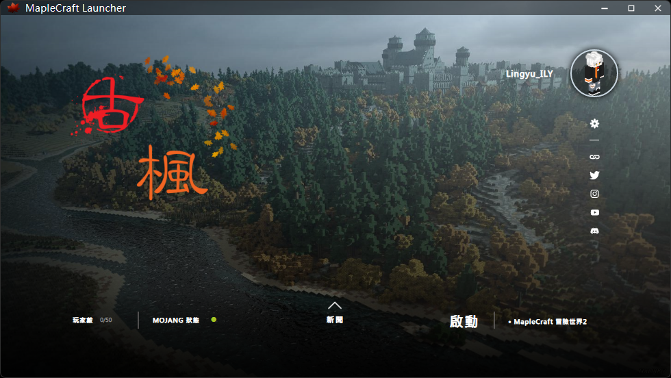

<h1 align="center">古楓啟動器 Ancientmaple Launcher</h1>

## 下載

你可以至 [GitHub Releases](https://github.com/Lingyu-ILY/MapleCraftLauncher/releases) 下載

#### 最新發布版本

#### 最新預發布版本

---

### credits

Original Author
Daniel Scalzi | https://github.com/WesterosCraftCode

---
